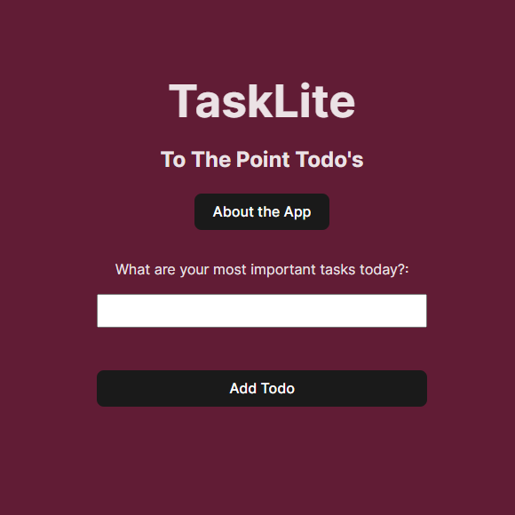

# TaskLite: The "To The Point" Todo App



## Description

Yes, it's ANOTHER Todo app! I won't beat around the bush and say mines amazing, I've created it for a couple reasons:

1. It was a nice simple project to be able to explore React and various storage options.
2. I wanted an app that forced me to be specific about my priorities for the day, hence the restricted number of todos.
3. It has provided some good hits of motivation by providing quick wins when I've been struggling with other, more complicated projects.

### So what sets this one apart? ⭐

As I've said above, I wanted a focused list of todos. This app restricts the number of todos you can have to 3. Once you've got 3 on your list the ability to add any more goes away, and you can only regain it by completing (or deleting) one or more from your list.

## Tech Stack 💽

- Typescript
- React (Vite)
- Node.js
- Lokijs - In-memory JavaScript database but modified for peristence using localStorage

## Development Tools 🔨

- Vite - Build tool and dev server
- ESLint - Code linting
- Prettier - Code formatting
- Husky - Git hooks

## Notable Features 👀

- Notable Features
- In-memory database with localStorage persistence
- Form validation
- Modal dialogs
- Responsive design
- Git hooks for code quality

## Getting Started

Open up the terminal and execute the following command:

```
npm run dev
```

It's as simple as that! Have fun. You can also find it online at [TaskLite](https://todo.saffagonerogue.me/)
